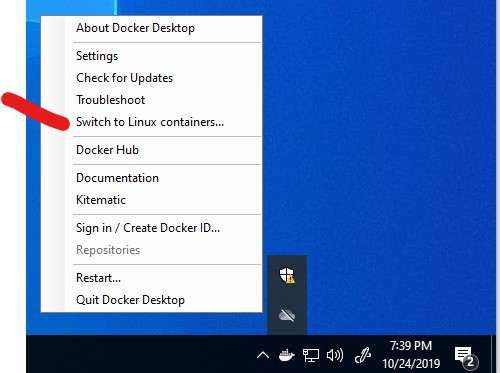
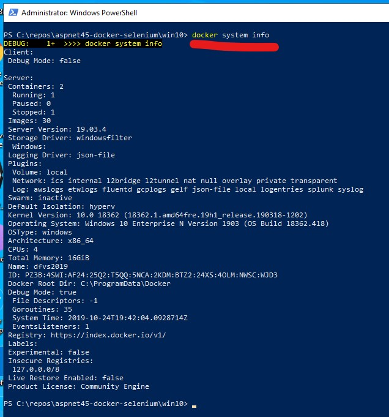
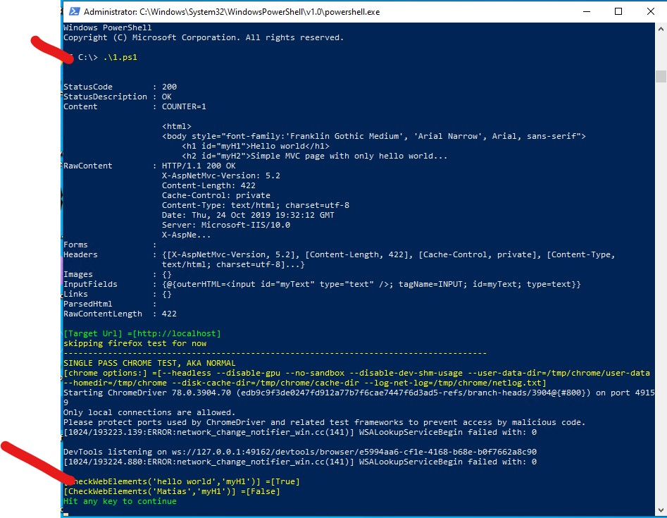

# SELENIUM TESTS FOR .NET FRAMEWORK 4.X IN A WINDOWS 10 CONTAINER

This document shows you how to build out a container that:

* Contains a Mvc45 web application
* Contains a selenium test executing against the Mvc45 web application
* Runs in a container using Windows 10 and .NET Framework 4.8

## PRE-REQUISITES

* Windows 10 v.latest.  
* Install Docker for Windows into Windows 10. Other platforms may work but are not tested.  https://docs.docker.com/docker-for-windows/
* Git for Windows and some knowledge of how to clone a repo down.  https://git-scm.com/download/win

## CLONE DOWN THIS REPO

* Open a command prompt and navigate to where you with this repo to be copied.
* Issue the following command to clone the repo locally

```powershell
> git clone https://github.com/jhealy/aspnet45-docker-selenium.git
```

## MAKE SURE DOCKER IS SET TO WINDOWS CONTAINERS

* Locate docker in the task bar of Win10 and click on it
* If Docker has a menu entry that says "Switch to Linux containers..." you are fine.  This means you are in Windows container mode.
* If Docker has a menu entry that says "Switch to Windows containers..." click it.  You are in Linux container mode and must switch to Windows containers.  Wait for docker to restart.



* Open a command prompt and issue the following command.  You should see info about the current state of docker.  If the command doesn't run something has happened to docker.

```powershell
> docker system info
```



## BUILD OUR CONTAINERS

Docker uses [dockerfiles](https://docs.docker.com/engine/reference/builder) to specify how to build out and label containers.  In this repo are a series of powershell scripts which execute a series of dockerfiles to build out the containers.  

Note running the docker builds, especially the first dockerfiles for the base containers can take a bit. The main time activity is downloading the base docker image. Make sure you have a fast network connection and a book to read.

* Open a powershell window and navigate to the root of this repo.  
* Run the following commands.  You will be left inside the running container that is our test

```powershell
> cd win10
> .\win10.01.buildwin10.ps1
> .\win10.02.buildaspnet.ps1
> .\win10.03.buildbasecontainer.ps1
> .\win10.04.buildtestcontainer.ps1
```

Note we are now in an interactive shell inside our container.  Run the following command to run the test.  Test results are routed to the screen.

```powershell
> .\1.ps1
```

In the screenshot below, you can see the CheckWebElements call succeeded.



To exit the container and return to the shell of your local machine / vm type "exit" in the container and hit enter.

```powershell
> exit
```

To restart the container and rerun the test, issue the following command in a powershell window:

```powershell
>
```
