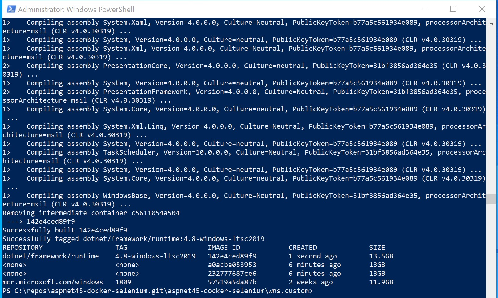
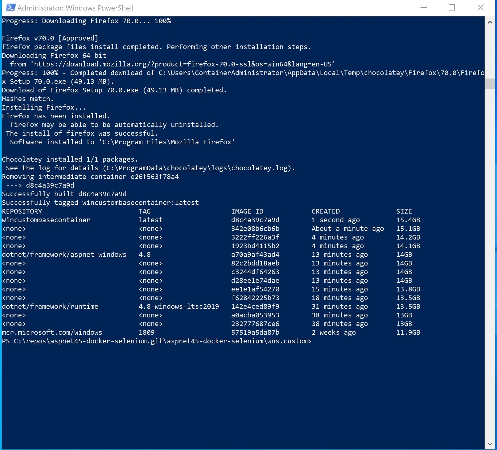
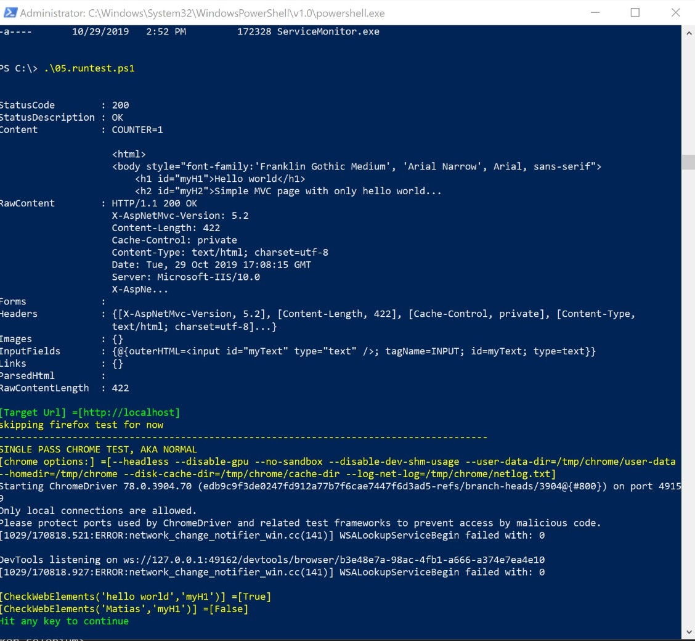

# SELENIUM TESTS FOR .NET FRAMEWORK 4.X IN CUSTOM .NET FRAMEWORK CONTAINER

This document shows you how to build out a container that:

* Contains a Mvc45 web application
* Contains a selenium test executing against the Mvc45 web application
* Runs in a container using Windows and .NET Framework 4.8

NOTE: Images are currently not in tune with directory struction.  Mentally change win10 to windows-custom-image until it gets fixed! jhealy....

## PRE-REQUISITES

* Windows 10 v.latest or Windows server to host docker desktop.  
* Install Docker for Windows into Windows 10. Other platforms may work but are not tested.  https://docs.docker.com/docker-for-windows/
* Git for Windows and some knowledge of how to clone a repo down.  https://git-scm.com/download/win

## CLONE DOWN THIS REPO

* Open a command prompt and navigate to where you with this repo to be copied.
* Issue the following command to clone the repo locally

```powershell
PS > git clone https://github.com/jhealy/aspnet45-docker-selenium.git
```

## MAKE SURE DOCKER IS SET TO WINDOWS CONTAINERS

* Locate docker in the task bar of Win10 and click on it
* If Docker has a menu entry that says "Switch to Linux containers..." you are fine.  This means you are in Windows container mode.
* If Docker has a menu entry that says "Switch to Windows containers..." click it.  You are in Linux container mode and must switch to Windows containers.  Wait for docker to restart.


* Open a command prompt and issue the following command.  You should see info about the current state of docker.  If the command doesn't run something has happened to docker.

```powershell
PS > docker system info
```


## BUILD OUR CONTAINERS

Docker uses [dockerfiles](https://docs.docker.com/engine/reference/builder) to specify how to build out and label containers.  In this repo are a series of powershell scripts which execute a series of dockerfiles to build out the containers.  

Note running the docker builds, especially the first dockerfiles for the base containers can take a bit. The main time activity is downloading the base docker image. Make sure you have a fast network connection and a book to read.

* Open a powershell window and navigate to the win10 directory in the repo.
* Run the command below.  Note this command can take up to 20 minutes to run so get coffee. This command does not need to run for each new test build.  We are using it to build out .NET Framework Win10 images.  Note the output shows the current image list on the machine.

```powershell
PS > .\01.buildwindows.ps1
```



* Run the following command to add asp.net support to our image.

```powershell
PS > .\02.buildaspnet.ps1
```


* Run the following command to enable websockets, as well as install chrome and firefox into our container using chocolatey.

```powershell
PS > .\03.buildbasecontainer.ps1
```



* Run the following command.  The website and selenium test are moved into our container.  You won't ordinarily see the screen below but it shows the copy operations begin run by the dockerfile.

```powershell
PS > .\04.buildtestcontainer.ps1
```



* You will have been left in an interactive terminal inside the running container with the seleniumtest and website contained within.


* Note we are now in an interactive shell inside our container.  Run the following command to run the test.  Test results are routed to the screen, but could be dumped to logs for parsing, or any other options you can code.

```powershell
PS > .\05.runtest.ps1
```

In the screenshot below, you can see the CheckWebElements call succeeded.


To exit the container and return to the shell of your local machine / vm type "exit" in the container and hit enter.

```powershell
PS > exit
```

Carpe docker!
